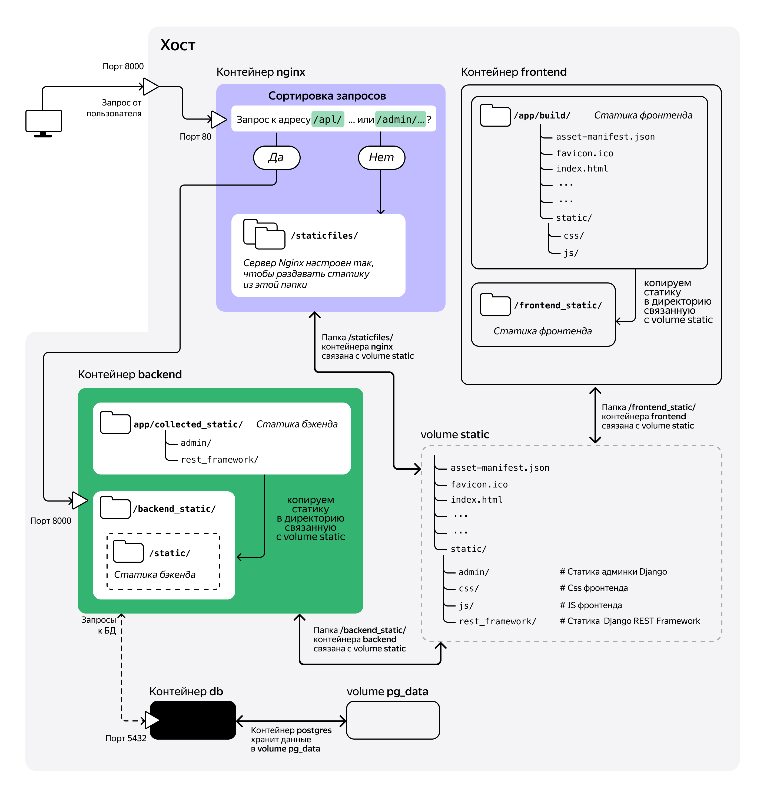

# Taski-docker
The simplest application for planning your tasks.  This project consists of a backend application on Django and a frontend application on React.

The application has two lists depending on the task status:
* completed
* not completed

You can create, edit, delete, transfer a task from one status to another.
We will deploy this project on a server in containers using CI/CD.

# Deploy localy
The Docker containers we will be working with will use Linux as the operating system kernel. For Windows 10 and 11: install Windows Subsystem for Linux.

Install Windows Subsystem for Linux according to the instructions on the official Microsoft website. If your computer meets the system requirements, it will also be suitable for installing WSL2.

You can use any available terminal to work with Docker, to your taste: PowerShell, cmd, Git Bash, or the Ubuntu terminal from WSL. We recommend working in Git Bash.

After installing WSL: installing Docker on Windows
Go to the official website of the project and download the Docker Desktop installation file.
Run it: a program for managing containers (docker daemon) and docker clients - a graphical interface and a command line interface - will be installed on your computer.

## Packaging the project into a Docker image
In the backend/ directory of the project, create a file called Dockerfile. The name must begin with a capital letter; the extension does not need to be specified. Fill the file with the following instructions:

```
FROM python:3.9

WORKDIR /app

RUN pip install gunicorn==20.1.0

COPY requirements.txt .

RUN pip install -r requirements.txt --no-cache-dir

COPY . .

CMD ["gunicorn", "--bind", "0.0.0.0:8000", "backend.wsgi"]
```
Some files and directories should not be included in the image: they are not needed there, and should be excluded when copying. Such exclusions can be listed in the .dockerignore file; it should be located in the same directory as the Dockerfile. The .dockerignore file works the same way as .gitignore. Add the following directories and files to it:
```
venv
.git
db.sqlite3
```
There are also other files that should be added to .dockerignore:
* IDE files: .idea, .vscode, and others;
* files with environment variables: for example, .env.

Project migrations should be included in the image, do not add them to .dockerignore.

## Building the Taski-docker backend image.
Make sure Docker is running. Open a terminal, go to the backend/ directory of the Taski project and build the image:
```
docker build -t taski_backend .
```
Test run of the backend container:
```
docker run --name taski_backend_container --rm -p 8000:8000 taski_backend
```
Open the page http://localhost:8000/api/ in the browser, the application should respond.

Perform migrations in the taski_backend_container container:
```
docker exec taski_backend_container python manage.py migrate
```
Stop the container with Ctrl+C in the same terminal or with the command docker container stop taski_backend_container in a new terminal window. This will remove the container.

## Building the Taski-docker frontend image.
The Dockerfile must be placed in the frontend/ folder of the Taski project.
The image in the app/build/ folder will store
static files (HTML, JS, and CSS) of the frontend application.

When the container starts, the built-in Node.js development web server is launched.
The statics are distributed directly from the container to port 8000.

To prevent dependency files and project builds from getting into the image,
add .dockerignore to the frontend/ directory.

Warnings about package versions may appear during the build — they can be ignored,
since these packages are used only when building the project.

In the frontend/ directory, place the .dockerignore file with the following contents:
```
node_modules
build
```
Go to the frontend directory and build the image:
```
docker build -t taski_frontend .
```
Run the container interactively, with the -it switch, and bind port 8000 of the container to port 8000 of the host:
```
docker run --rm -it -p 8000:8000 --name taski_frontend_test taski_frontend
```
Open a browser and make sure that the Taski frontend is accessible at http://127.0.0.1:8000/. The frontend SPA does not interact with the backend yet: for this, you will need to configure them to run together; however, the web page opens successfully.

Stop the container with the Ctrl+C shortcut or run docker container stop taski_frontend_test in a new terminal window. This will remove the container.

## Application architecture


## PostgreSQL
In the root of the project, create a .env file:
```
# .env file
POSTGRES_USER=django_user
POSTGRES_PASSWORD=mysecretpassword
POSTGRES_DB=django
# Add variables for the Django project:
DB_HOST=db
DB_PORT=5432
```
Change the settings.py file to use these variables:
```
import os

...

# Replace the current DATABASES setting with these lines
DATABASES = {
    'default': {
        # Change the Django setting: now the postgresql
        # backend will be use for work
        'ENGINE': 'django.db.backends.postgresql',
        'NAME': os.getenv('POSTGRES_DB', 'django'),
        'USER': os.getenv('POSTGRES_USER', 'django'),
        'PASSWORD': os.getenv('POSTGRES_PASSWORD', ''),
        'HOST': os.getenv('DB_HOST', ''),
        'PORT': os.getenv('DB_PORT', 5432)
    }
}

...
```
Django uses the psycopg2-binary library to work with PostgreSQL. If you don't install it, the postgresql backend won't work.
Add the new psycopg2 package to the requirements.txt file.

Rebuild the taski_backend image with the updated dependencies file: in the backend/ directory, run the docker build command:
```
docker build -t taski_backend .
```
Docker volume for the PostgreSQL container:
```
docker volume create pg_data
```
In the PostgreSQL image, all data is stored in the /var/lib/postgresql/data directory. This is the directory that needs to be "redirected" to a volume outside the container:
```
docker run --name db \
       --env-file .env \
       -v pg_data:/var/lib/postgresql/data \
       postgres:13.10
# Start a container named db,
# pass environment variables from the .env file to the container,
# connect a Docker volume named pg_data,
# create a container from a postgres image with the 13.10 tag
```

## Docker network: a network of containers
Let's create a network named django-network:
```
docker network create django-network
```
Connect the backend and database containers to the network.
The db container is already running, you can immediately connect it to the docker network. Run the command:
```
# Connect the db container to the django-network network.
docker network connect django-network db
```
The container with the backend has not yet been launched, we will connect it to the network right at startup. The name of the network to which the container should connect is specified as a parameter of the --net key.
Start the container with the Django application:
```
docker run --env-file .env \
           --net django-network \
           --name taski_backend_container \
           -p 8000:8000 taski_backend
```
Now that both containers are running and networked, we can apply Django migrations. Open a new terminal window and run the migration command in the backend container:
```
docker exec taski_backend_container python manage.py migrate
```
Now when you stop the containers, the database information will be saved on the host.

## container and config for Nginx
Prepare to launch the container with Nginx - create a gateway/ folder in the root of the project with two files:
* Dockerfile - to create an Nginx image with the necessary settings;
* nginx.conf - to configure the Nginx server.

## backend statics
First, in the Taski project, configure the collection of statics in the collected_static/ folder. In the settings.py file, check the value of the STATIC_URL constant and add the STATIC_ROOT constant:
```
# When planning the architecture, it was decided that
# Django static files should be available at /static/
STATIC_URL = '/static/'
# Specify the root directory for collecting static files;
# in the container, this will be /app/collected_static
STATIC_ROOT = BASE_DIR / 'collected_static'
# Now when calling the python manage.py collectstatic command
# Django will copy all static files to the collected_static directory
```
Also, the IP address and (if any) domain name of your server must be added to the ALLOWED_HOSTS list in the settings.py file.
```
ALLOWED_HOSTS = ['123.123.123.123', '<your_domain>']
```
Restart Docker Compose:
```
# Containers need to be rebuilt because settings.py was changed
docker compose stop && docker compose up --build
```
When the network started, volume static was connected to the backend and gateway containers.

Run the static build command. After that, run the command to copy the collected files to /backend_static/static/ — move the files not to /backend_static/, but to a subfolder: this way the file addresses for Nginx will match the addresses of the static files that the Django project expects.
```
# Collect Django statics
docker compose exec backend python manage.py collectstatic
# Application statics in the backend container
# will be collected in the /app/collected_static/ directory.

# Now copy statics from this directory to /backend_static/static/;
# this statics will go to volume static in the /static/ folder:
docker compose exec backend cp -r /app/collected_static/. /backend_static/static/
```

## Frontend statics
In docker-compose.yml, you need to make a couple of changes to the frontend container description:
declare the /frontend_static/ directory association with the static volume (the directory will be created automatically);
add the command key and run the file copy command: cp -r /app/build/. /frontend_static/.

## local run
Restart Docker Compose and check the main page http://localhost:8000/:
```
docker compose stop && docker compose up
```
When accessing http://localhost:8000/ you should see the Taski-docker home page, which should now be fully functional. Test this by adding a task through the home page interface.

## Useful commands
Full list of commands
```
docker
```
Start a container from a hello-world image
```
docker run --name hello-container hello-world
```
Start an nginx container with host port forwarding to the container port
```
docker run -p 8080:80 --name nginx-container nginx
```
Delete a container nginx-container
```
docker container rm nginx-container
```
stop a container ctrl-c, start after stop
```
docker container start nginx-container
docker start nginx-container
```
stop a container
```
docker stop nginx-container
docker container stop nginx-container
```
remove a container
```
docker container rm taski_backend_container
```
list running containers
```
docker container ls
```
list all containers
```
docker container ls -a
```
To execute instructions in a container
```
docker exec -it <CONTAINER ID> any_instruction
```
command to run terminal in container:
```
docker exec -it nginx-container bash
```
create file in container:
```
docker exec nginx-container touch /my-file
```
To see list of images stored locally:
```
docker image ls
```
```
docker image --help
```
see unused images
```
docker image ls -f "dangling=true" -q
```
remove more unused images
```
docker image rm $(docker image ls -f "dangling=true" -q)
```
image build command
```
docker build -t taski_backend .
```
Test container run
```
docker run --name taski_backend_container --rm -p 8000:8000 taski_backend
```
Run migrations in the taski_backend_container container:
```
docker exec taski_backend_container python manage.py migrate
```
Delete volume
```
docker volume rm volume_name
```
Other volume commands
```
docker volume
```
Create volume
```
docker volume create pg_data
```
Build image for DockerHub
```
docker build -t username/taski_backend:latest backend/
```
Authenticate Docker daemon on DockerHub
```
docker login
```
Run container for PostgreSQL, having previously created all environment variables and volume
```
docker run --name db \
       --env-file .env \
       -v pg_data:/var/lib/postgresql/data \
       postgres:13.10
```
Запустить консольный клиент psql в контейнере
```
docker exec -it db psql -U django_user -d Django
```
Создать сеть
```
docker network create django-network
```
Присоединить к сети django-network контейнер db, который уже запущен
```
docker network connect django-network db
```
Запуск Django контейнера с подключением к сети
```
docker run --env-file .env \
           --net django-network \
           --name taski_backend_container \
           -p 8000:8000 taski_backend
```
Running migration after Django and Postgresql container are up and running
```
docker exec taski_backend_container python manage.py migrate
```
Version
```
docker compose version
```
Run the whole orchestra - in the terminal in the folder with docker-compose.yml run the command:
```
docker compose up
```
Containers need to be rebuilt because settings.py was changed
```
docker compose stop && docker compose up --build
```
It will be useful to run the command
```
sudo docker system prune -af
```
this will remove all unnecessary objects that you may have created in docker during the execution of sprint tasks - unused containers, images and networks.
```
sudo docker system prune --all
```
Go to the directory where the docker-compose.yml file is located and run migrations:
```
docker compose exec backend python manage.py migrate
```
Collect Django statics
```
docker compose exec backend python manage.py collectstatic
```
Application statics in the backend container
```
# will be collected in the directory /app/collected_static/.
# Now copy the statics from this directory to /backend_static/static/;
# this statics will go to the volume static in the folder /static/:
docker compose exec backend cp -r /app/collected_static/. /backend_static/static/ 
```
To remove both containers and volumes, run the command 
``` 
docker compose down -v 
```
Увидеть список таких безымянных образов (они называются dangling, англ. «болтающиеся») можно так:
```
docker image ls -f "dangling=true" -q
```
Почистить компьютер от таких образов можно такой командой:
```
docker image rm $(docker image ls -f "dangling=true" -q)
```

# Deploy on server. CI/CD
## Create docker-compose.production
Создадим отдельный файл конфигурации Docker Compose, который будет управлять запуском контейнеров на боевом сервере. Он будет аналогичен тому, который уже есть, но в нём будут использоваться собранные образы из Docker Hub.

## Устанавливаем Docker Compose на сервер
Поочерёдно выполните на сервере команды для установки Docker и Docker Compose для Linux. Наберитесь терпения: установка займёт некоторое время. Выполнять их лучше в домашней директории пользователя (переместиться в неё поможет команда cd без аргументов).
```
sudo apt update
sudo apt install curl
curl -fSL https://get.docker.com -o get-docker.sh
sudo sh ./get-docker.sh
sudo apt install docker-compose-plugin
```

## Запускаем Docker Compose на сервере
Скопируйте на сервер в директорию taski/ файл docker-compose.production.yml. Сделать это можно, например, при помощи утилиты SCP (secure copy) — она предназначена для копирования файлов между компьютерами. Зайдите на своём компьютере в директорию taski/ и выполните команду копирования:
```
scp -i path_to_SSH/SSH_name docker-compose.production.yml \
    username@server_ip:/home/username/taski/docker-compose.production.yml
```
* path_to_SSH — путь к файлу с SSH-ключом;
* SSH_name — имя файла с SSH-ключом (без расширения);
* username — ваше имя пользователя на сервере;
* server_ip — IP вашего сервера.

Есть и другой вариант: создайте на сервере пустой файл docker-compose.production.yml и с помощью редактора nano добавьте в него содержимое из локального docker-compose.production.yml.

Скопируйте файл .env на сервер, в директорию taski/.

Для запуска Docker Compose в режиме демона команду docker compose up нужно запустить с флагом -d
```
sudo docker compose -f docker-compose.production.yml up -d
``` 
Проверьте, что все нужные контейнеры запущены:
```
sudo docker compose -f docker-compose.production.yml ps
```
Выполните миграции, соберите статические файлы бэкенда и скопируйте их в /backend_static/static/:
```
sudo docker compose -f docker-compose.production.yml exec backend pyth on manage.py migrate 

sudo docker compose -f docker-compose.production.yml exec backend python manage.py collectstatic 

sudo docker compose -f docker-compose.production.yml exec backend cp -r /app/collected_static/. /backend_static/static/ 
```

## Перенаправляем все запросы в докер
Было так:
```
# До этой строки — остальная часть секции server
    location /api/ {
        proxy_set_header Host $http_host;
        proxy_pass http://127.0.0.1:8000;
    }

    location /admin/ {
        proxy_set_header Host $http_host;
        proxy_pass http://127.0.0.1:8000;
    }

    location / {
        root   /var/www/taski;
        index  index.html index.htm;
        try_files $uri /index.html =404;
    }
# Ниже идёт часть про certbot
```
Должно стать так (три блока location заменяем на один):
```
# Всё до этой строки оставляем как было.
    location / {
        proxy_set_header Host $http_host;
        proxy_pass http://127.0.0.1:8000;
    }
# Ниже ничего менять не нужно.
```
Чтобы убедиться, что в конфиге нет ошибок — выполните команду проверки конфигурации:
```
sudo nginx -t
```
Перезагрузите конфиг Nginx:
```
sudo service nginx reload
```